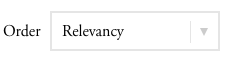

# Component Reference

Please add your components here with a description of how to use them.
If a separate doc is required, add it to the component's directory as a
`README.md` and create a link to it here.

- [Bordered Dropdown](#bordered-dropdown)

## Bordered Dropdown

An Artsy styled drop down menu. This component comes with two parts



Include the jade mixin:

````jade
include ../../bordered_dropdown/mixin

+bordered-dropdown('Recently Added', 'Sort By')
  a( data-sort='date_created' ) Recently Added
  a( data-sort='-date_created' ) Artwork Year
````

Add the view:

````coffeescript
new BorderedDropdown el: $('.bordered-dropdown')
````

If you need finer control feel free to build your own html and just use the CSS classes. If you're doing server-side sorting the Backbone view isn't necessary.
